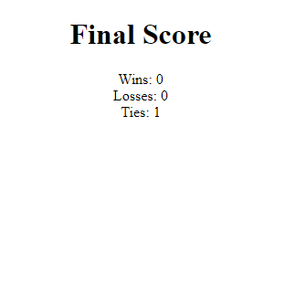

# <Your-Project-Title>

## Description

Here's a simple rock paper scisors game where you play against the computer. How many times can you beat the machine? Find out [here](https://tuinderj.github.io/rock-paper-scisors/)

- I built this project to work into the basics of javascript.
- This provides something simple to do when you have a bit of downtime.
- I learned about randomization in JavaScript.

## Installation

N/A

## Usage

When you load the page, you'll be promted for an input. After giving the input, follow the prompts to see if you won against the computer.

